#  TASK - 1 : Environment Setup & RISC-V Reference Bring-Up

## Objective
Set up the development environment and successfully run a working RISC-V reference design, followed by running the VSDFPGA labs on the same environment.
This task focuses on:
 - Toolchain readiness
 - Understanding the RISC-V execution flow
 - Preparing for upcoming FPGA and IP development work

---
## STEP - 1 : Setting up GitHub Codespace 

In this step, the development environment is set up using GitHub Codespaces to ensure a consistent and pre-configured workspace for the VSD FPGA Mini Program.

1. Fork the repository at ` https://github.com/vsdip/vsd-riscv2 ` to your GitHub account.

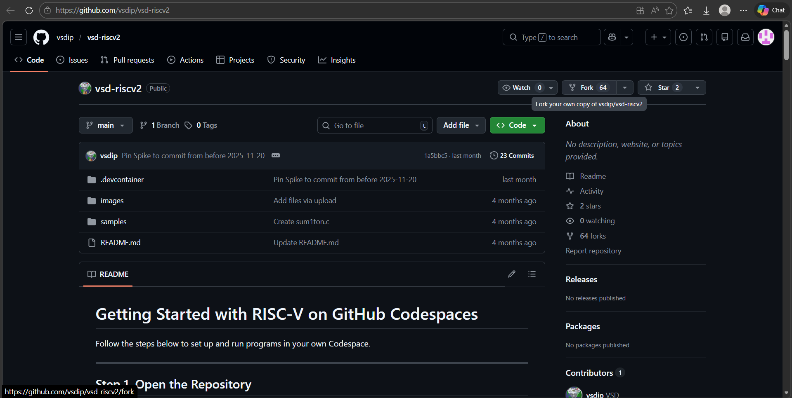

2. Navigate to the repository and click on the “Code” button and select the “Codespaces” tab and create a new Codespace instance.

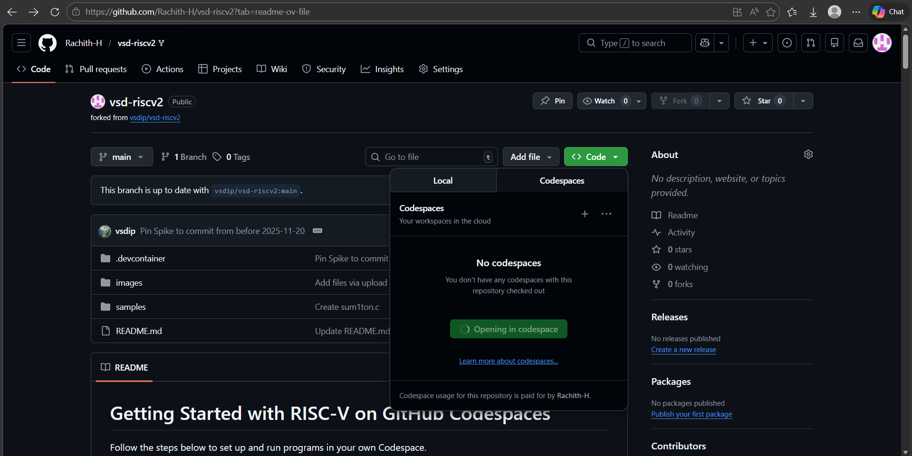 

3. Wait for the environment to initialize, all required dependencies and tools will be automatically configured.
The window appears as shown below.

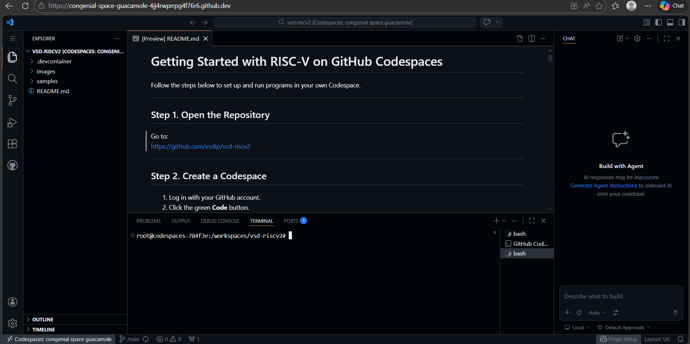 

4. Once the Codespace is ready, open the terminal and verify the setup, by checking the versions of the available tools.
```
riscv64-unknown-elf-gcc --version
spike -help
iverilog -V
```

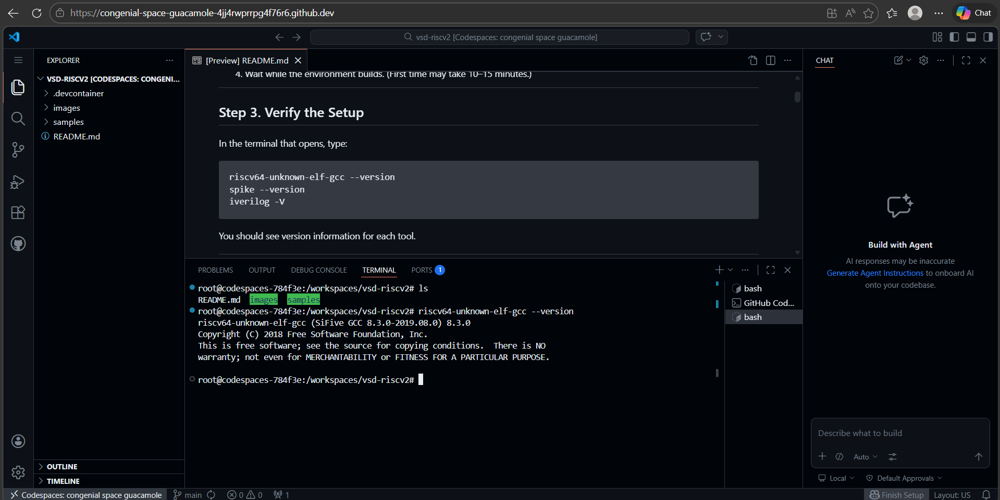 
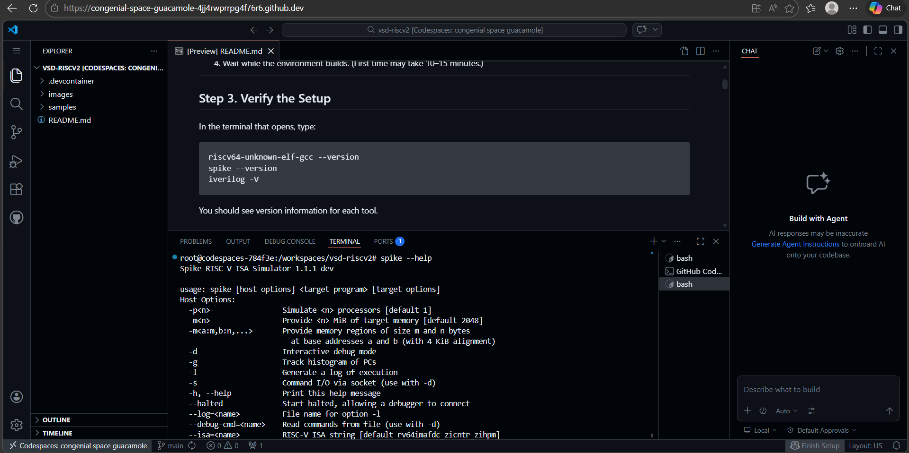 
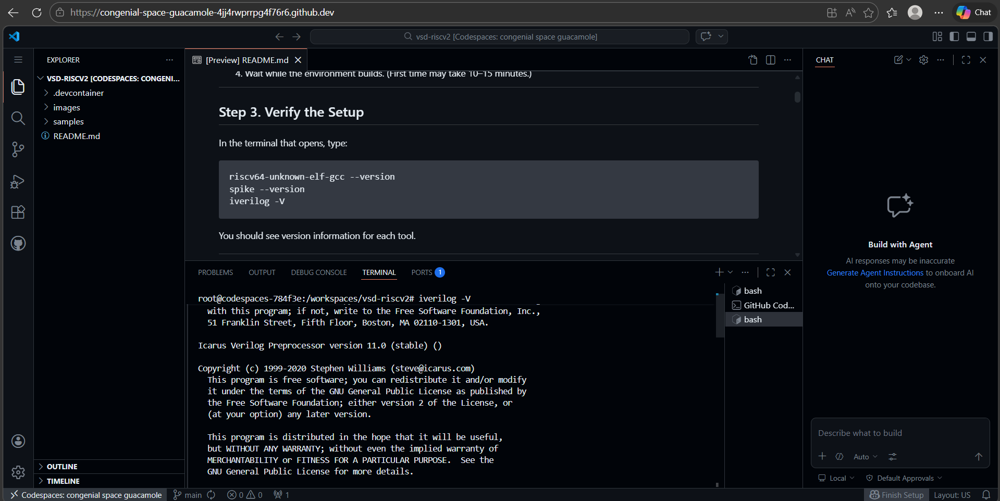 

---
## STEP - 2 : Verifying the RISC-V Reference Flow 

In this step, the basic RISC-V software flow is verified by compiling and simulating C programs using the `riscv64-unknown-elf-gcc` toolchain.

1. Navigate to the samples directory containing the sample program.
Compile the provided sum1ton.c program using the RISC-V GCC compiler.
Generate the executable and simulate it in spike to observe the output.
```
cd samples/
riscv64-unknown-elf-gcc -o sum1ton.o sum1ton.c
spike pk sum1ton.o
```

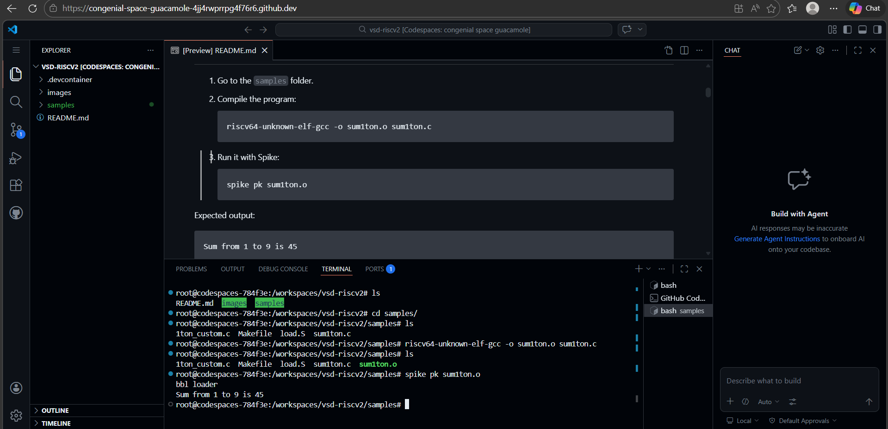  

After verifying the sample program, a custom C program is implemented:

2. Write a simple C program to convert kilometers to meters as shown below.
Compile the program using the RISC-V GCC compiler.
Run the compiled file and simulate it in spike to observe the output.

```
touch kmtom.c
code kmtom.c

riscv64-unknown-elf-gcc -o kmtom.o kmtom.c
spike pk kmtom.o
```
```

#include <stdio.h>

int main() {
    float km, meters;

    // enter kilometer value
    scanf("%f", &km);

    meters = km * 1000;

    printf("Distance in meters = %.2f\n", meters);

    return 0;
}

```

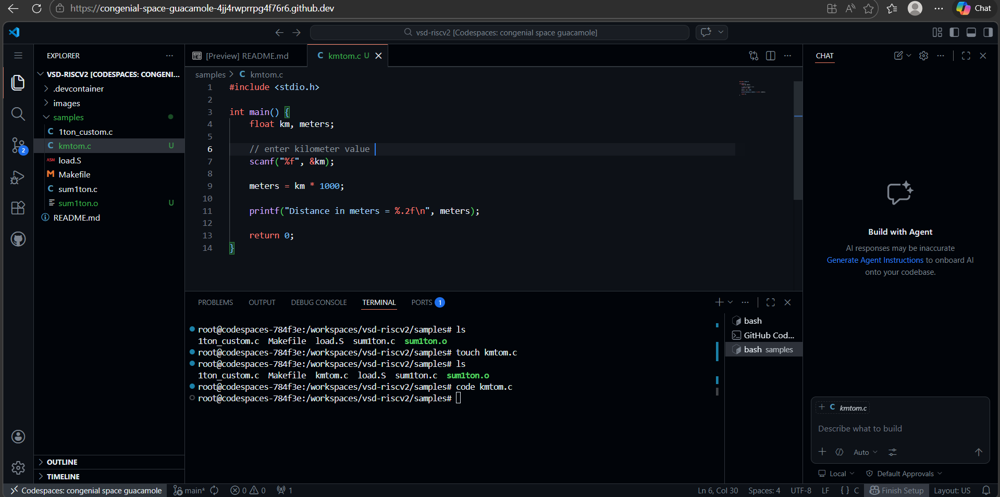   
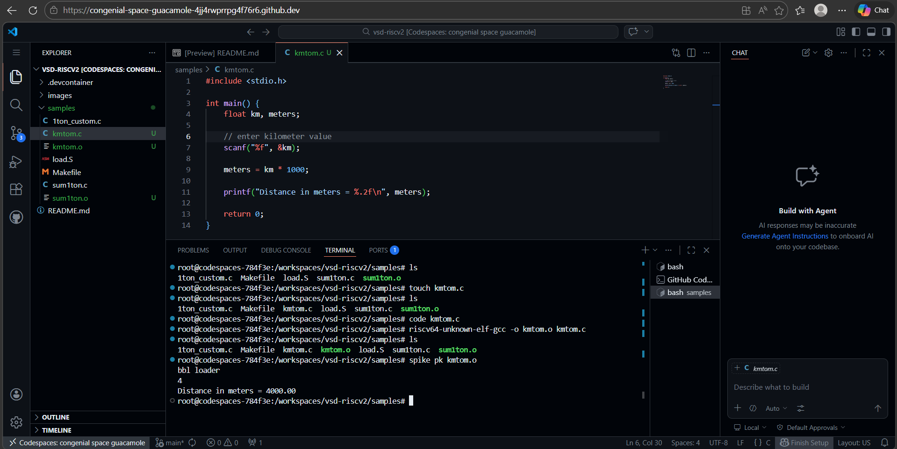   

Now the same compilation and simulation workflow is performed using the graphical Linux environment available within GitHub Codespaces. 

3. In your Codespace, click the PORTS tab.
Look for the forwarded port named noVNC Desktop (6080).
Click the Forwarded Address link.

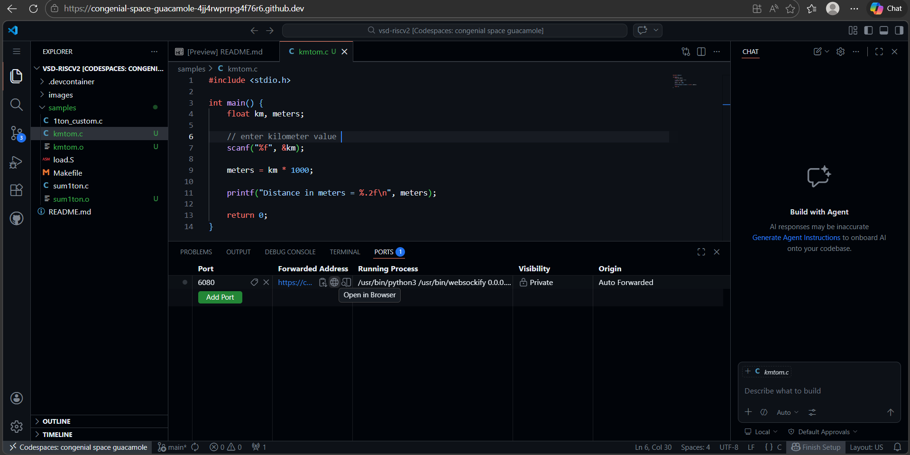   

4. A new browser tab opens with a directory listing. Click vnc_lite.html.

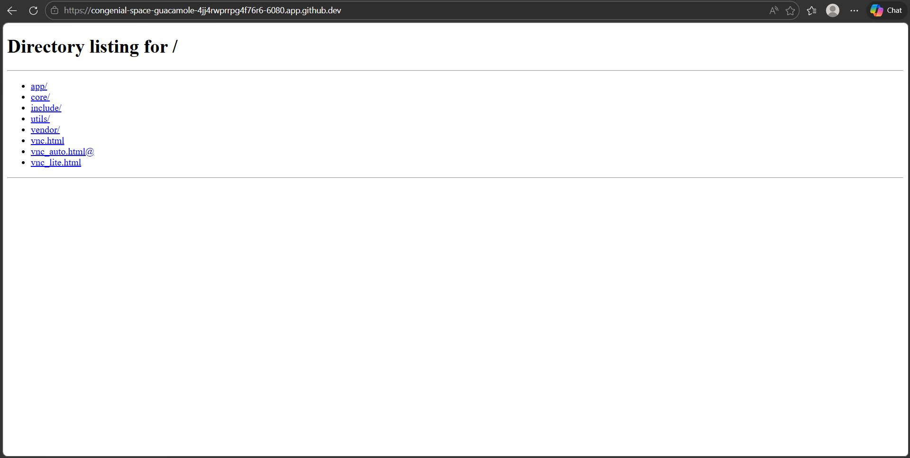   

5. The Linux desktop appears in your browser.
Right-click anywhere on the desktop background.
Select Open Terminal.

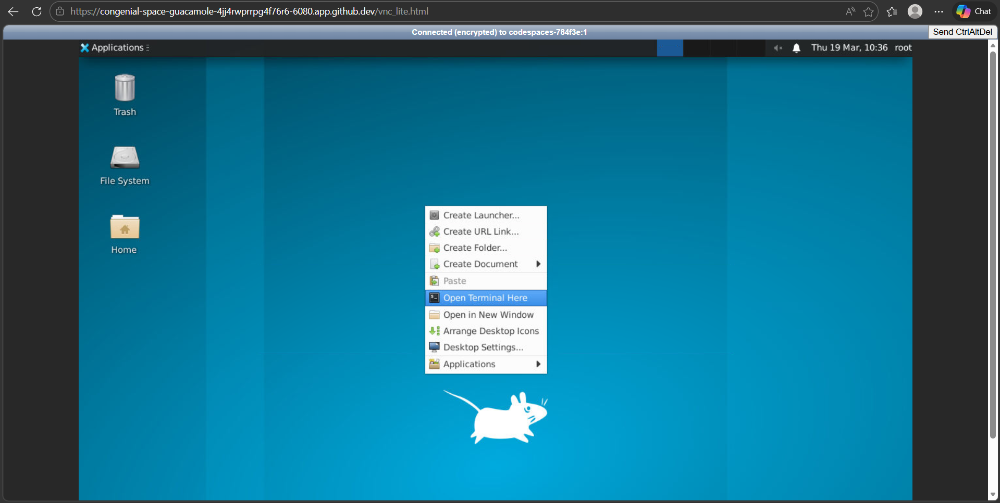    

6. Navigate to the samples directory containing the sample program.
Compile the provided sum1ton.c program using the native GCC tool and then also using the RISC-V GCC compiler.
Generate the executable and simulate it in spike to observe the output.
```
cd /workspaces/vsd-riscv2/
cd samples/

gcc sum1ton.c
./a.out

riscv64-unknown-elf-gcc -o sum1ton.o sum1ton.c
spike pk sum1ton.o

gcc kmtom.c
./a.out

riscv64-unknown-elf-gcc -o kmtom.o kmtom.c
spike pk kmtom.o
```

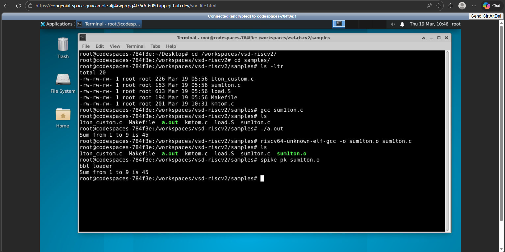      

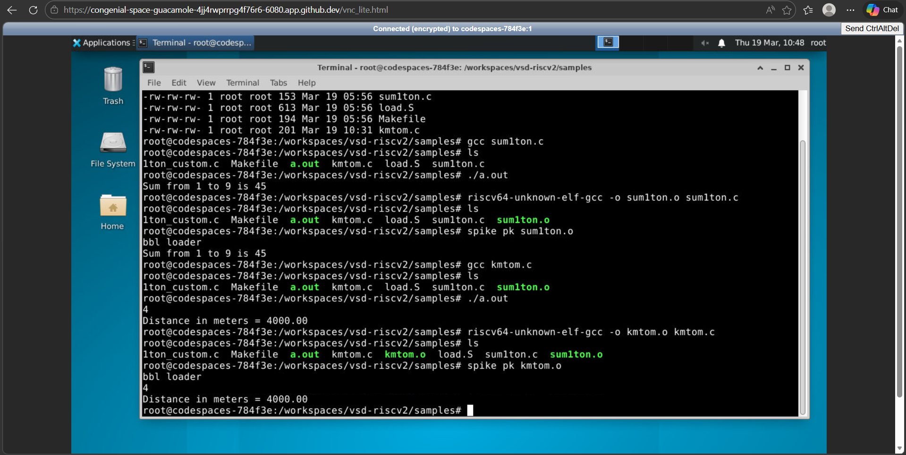  


7. Further, edit the `sum1ton.c` file , say n = 12 and rerun using the same commands.
```
gedit sum1ton.c
riscv64-unknown-elf-gcc -o sum1ton.o sum1ton.c
spike pk sum1ton.o
```
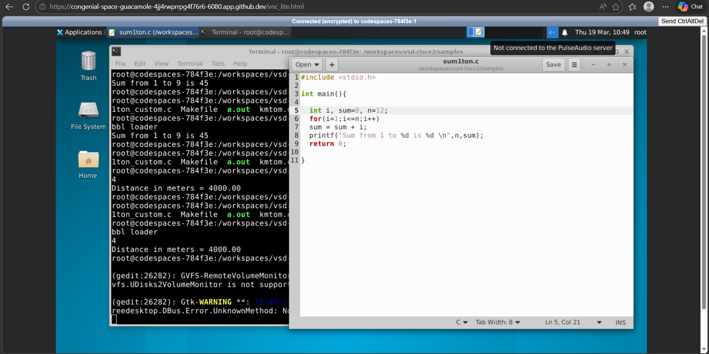   

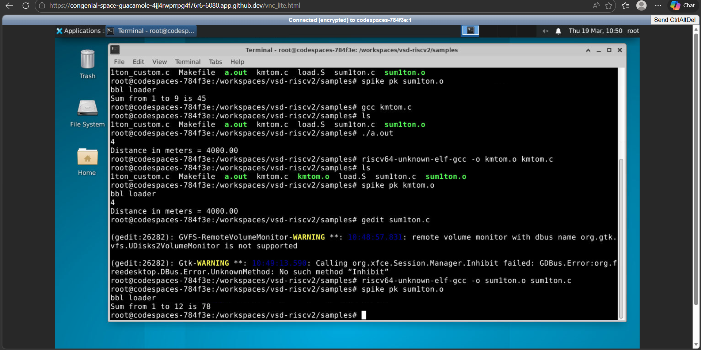  

---
## STEP - 3 : Running Basic VSDFPGA Labs

In this step, a program originally intended for FPGA execution is tested using software based simulation without using actual hardware.

1. Clone the repository `https://github.com/vsdip/vsdfpga_labs.git`. Navigate to the proper directory.

```
git clone https://github.com/vsdip/vsdfpga_labs.git
cd vsdfpga_labs/basicRISCV/Firmware
```

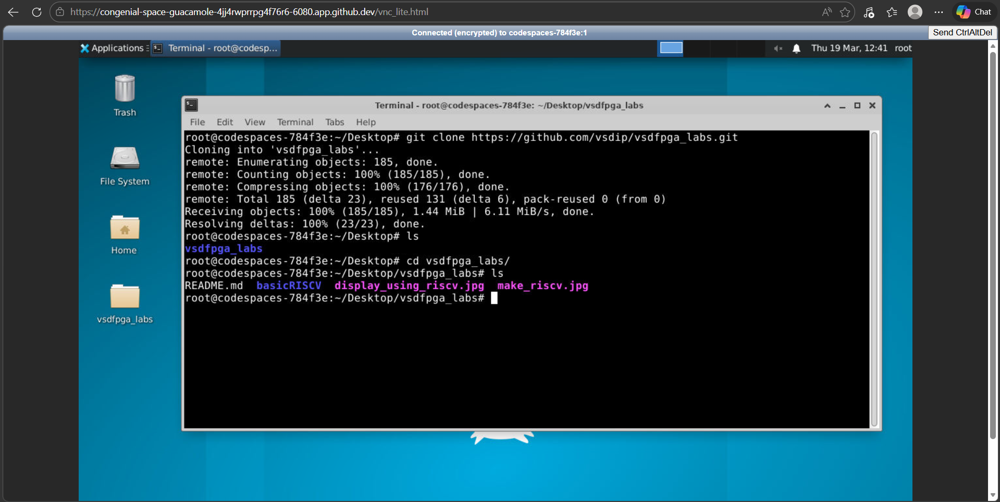  

 2. Now compile the `riscv_logo.c` program using native GCC and also using the RISC-V GCC compiler

```
gcc riscv_logo.c
./a.out

riscv64-unknown-elf-gcc -o riscv_logo.o riscv_logo.c
spike pk riscv_logo.o
```

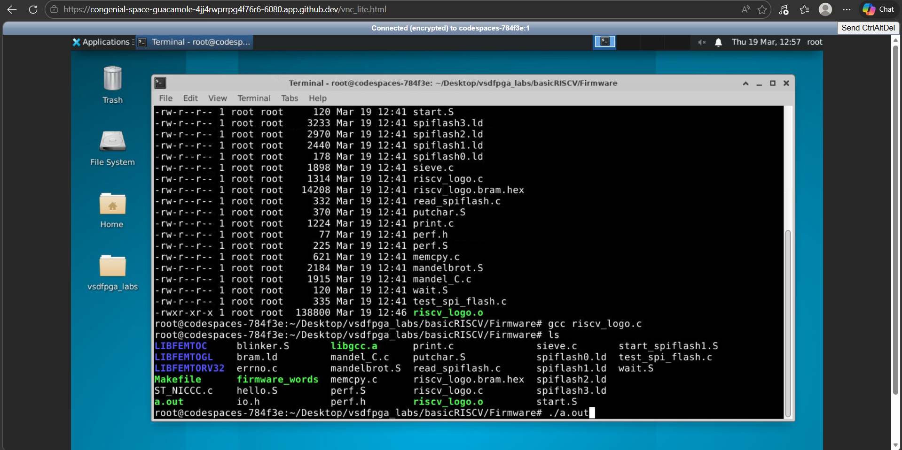    

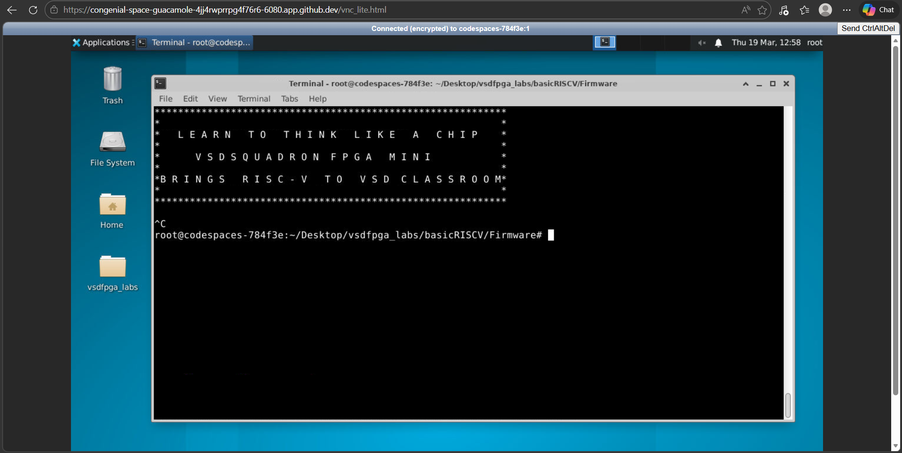  

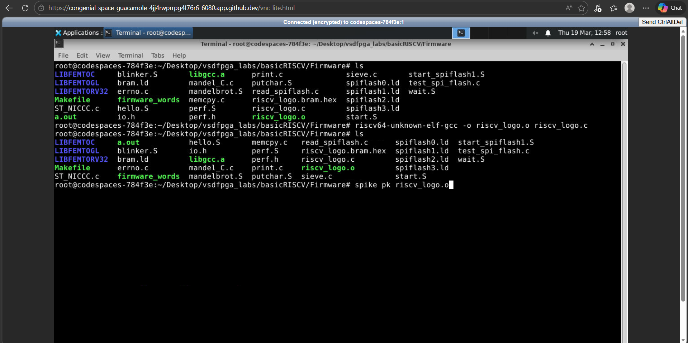  

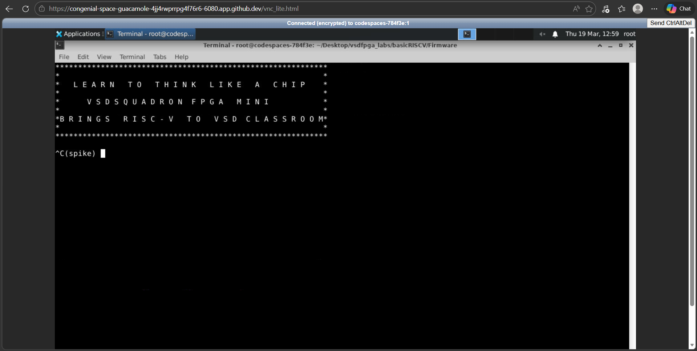   


