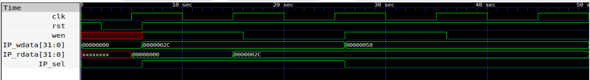

#  TASK - 2 : Design & Integrate Your First Memory-Mapped IP
---
## Objective
 - To design a simple memory-mapped IP, integrate it into the existing RISC-V SoC, and validate it through simulation. 
This task formally transitions the cohort from environment setup to real IP development

---

<details>
  <summary> STEP - 1 : Understand the existing SoC </summary>


#### **Overview**

The given [SoC](rtl/riscv.v) consists of a simple RISC-V processor integrated with on-chip memory and memory-mapped peripherals. The design follows a **memory-mapped I/O architecture**, where both RAM and peripherals are accessed using a unified address space.

---

#### **1. Processor–Memory Interface**

The processor communicates with memory and peripherals using a simple bus interface consisting of the following signals:

* `mem_addr` : Address generated by the CPU
* `mem_wdata` : Data to be written
* `mem_rdata` : Data read from memory/peripherals
* `mem_wmask` : Byte-wise write enable signal
* `mem_rstrb` : Read request signal

Write operations are identified when `mem_wmask` is non-zero, while read operations are triggered using `mem_rstrb`.

---

#### **2. Memory Organization**

The SoC contains an internal RAM module implemented as a 32-bit wide memory array. The memory is word-addressable, where the lower two bits of the address are ignored to ensure alignment.

* Program instructions and data are stored in RAM

---

#### **3. Address Decoding and Memory Mapping**

The SoC divides the address space into two regions:

* **RAM region** → when `mem_addr[22] = 0`
* **I/O region** → when `mem_addr[22] = 1`

This simple decoding mechanism determines whether a memory access is directed to RAM or to peripherals.

---

#### **4. Memory-Mapped I/O**

Peripheral devices are integrated using memory-mapped addressing. Each peripheral is assigned a unique address within the I/O region using a one-hot encoding scheme based on the word address.

##### **Existing peripherals:**

**a) LED Output (Write-only peripheral)**

* Controlled by writing to a specific address
* When the CPU writes data, the LED register is updated
* Only the lower bits of the data are used to drive physical LEDs

**b) UART (Serial Communication IP)**

* Used for transmitting data serially
* Writing to the UART data register sends a byte
* A status register indicates whether the UART is busy

---

#### **5. Data Flow During Access**

**Write Operation:**

1. CPU places address on `mem_addr`
2. Data is placed on `mem_wdata`
3. `mem_wmask` indicates active write
4. Address decoding selects RAM or I/O
5. Target module updates its internal register

**Read Operation:**

1. CPU places address on `mem_addr`
2. `mem_rstrb` is asserted
3. Selected module drives `mem_rdata`
4. CPU reads the returned value

---

#### **6. Integration of IPs in the SoC**

IP blocks are integrated by:

* Assigning a unique address in the I/O space
* Decoding the address using `mem_wordaddr`
* Generating control signals (e.g., write enable)
* Connecting data signals (`mem_wdata`, `mem_rdata`)
* Updating the read data multiplexer to include the new IP

This modular approach allows easy addition of new peripherals without modifying the processor.


</details>


<details>
  <summary> STEP - 2 : RTL Design of GPIO IP </summary>


### **Overview**

A General Purpose Input/Output (GPIO) [IP block](rtl/GPIO_reg_IP.v) is designed to provide a simple memory-mapped interface for the processor to interact with external signals. In this design, the GPIO module implements a 32-bit register that can be written to and read from by the CPU through the SoC bus.

The GPIO IP is integrated as a peripheral in the I/O address space and is accessed using standard load and store instructions from the RISC-V processor.

---

### **Design Objective**

* Provide a 32-bit register accessible via memory-mapped I/O
* Support write operations from the CPU
* Allow read-back of the stored value
* Ensure safe operation by enabling writes only when the IP is selected

---

### **Module Description**

The GPIO IP consists of a single 32-bit register that stores data written by the processor. The register updates only when both the write enable signal and the IP select signal are asserted, ensuring correct address-based access.

---

### **Signal Description**

| Signal Name | Direction | Description                                                                  |
| ----------- | --------- | ---------------------------------------------------------------------------- |
| `clk`       | Input     | System clock used for synchronous updates                                    |
| `rst`       | Input     | Reset signal to initialize the register                                      |
| `wen`       | Input     | Write enable signal indicating a write operation                             |
| `IP_sel`    | Input     | Select signal indicating that the current address corresponds to the GPIO IP |
| `IP_wdata`  | Input     | 32-bit data bus carrying data from the processor                             |
| `IP_rdata`  | Output    | 32-bit data bus used to return stored value to the processor                 |

---

### **Functional Behavior**

**Write Operation:**

* Occurs on the rising edge of the clock
* Triggered only when:

  * `wen = 1` (write operation active)
  * `IP_sel = 1` (address matches GPIO IP)
* The input data (`IP_wdata`) is stored in the internal register

**Read Operation:**

* The stored register value is continuously driven on `IP_rdata`
* When the CPU performs a read operation, this value is returned via the SoC read data path

The following image shows the simulation results of the designed IP with a sample [verilog testbench](rtl/GPIO_reg_IP_tb.v) using iverilog and Gtkwave.  

```
iverilog -o sim.out GPIO_reg_IP.v GPIO_reg_IP_tb.v
vvp sim.out
gtkwave waves.vcd
```



---

### **RTL Implementation Concept**

The internal register is updated using synchronous logic:

* On reset → register is cleared
* On valid write → register captures input data
* Otherwise → retains previous value

This ensures predictable and stable behavior of the GPIO IP.

---

### **Memory-Mapped Integration Context**

The GPIO IP is designed to operate within a memory-mapped I/O system. The SoC generates the `IP_sel` signal based on address decoding logic, while `wen` is derived from the write strobe signal of the processor.

This separation of concerns allows:

* The SoC to handle address decoding
* The IP to focus on functional behavior


The GPIO IP provides a simple and effective interface for processor-controlled output operations. Its clean separation between address decoding (handled by the SoC) and functional logic (handled by the IP) ensures modularity and ease of integration into the system.

</details>


<details>
  <summary> STEP - 3 : Integration of GPIO IP into the SoC </summary>


### **Overview**

The GPIO IP is integrated into the given [RISC-V SoC](rtl/riscv.v) using a memory-mapped I/O approach. The SoC already supports peripherals such as LEDs and UART, and the GPIO module is added as an additional peripheral within the I/O address space.

The integration involves assigning a unique address to the GPIO IP, generating control signals based on address decoding, connecting data paths, and updating the read data multiplexer.

---

### **1. Address Mapping**

A new address location is assigned to the GPIO IP using the existing bit-based decoding scheme:

* A new parameter is defined:

  ```verilog
  localparam GPIO_IP_bit = 3;
  ```

* The GPIO IP is mapped to the I/O region when:

  * `mem_addr[22] = 1` (I/O space)
  * `mem_wordaddr[GPIO_IP_bit] = 1`

This effectively assigns a unique base address for the GPIO peripheral within the memory-mapped I/O space.

---

### **2. Address Decode Signal (GPIO_sel)**

A selection signal is generated to identify when the CPU is accessing the GPIO IP:

```verilog
wire GPIO_sel = isIO & mem_wordaddr[GPIO_IP_bit];
```

**Purpose:**

* Ensures the GPIO IP responds only when:

  * The access is in the I/O region (`isIO`)
  * The address matches the assigned GPIO bit

---

### **3. Write Control Signal**

The SoC provides a global write indicator through `mem_wstrb`. This signal is used along with the selection signal inside the IP to control write operations.

* `mem_wstrb` is derived as:

  ```verilog
  wire mem_wstrb = |mem_wmask;
  ```

**Behavior:**

* `mem_wstrb = 1` → write operation
* `mem_wstrb = 0` → no write

The GPIO IP internally combines:

* `mem_wstrb` (write indication)
* `GPIO_sel` (address match)

to ensure safe and valid writes.

---

### **4. Data Path Connections**

The GPIO IP is connected to the SoC bus using the following signals:

* `mem_wdata` → connected to `IP_wdata` (write data input)
* `GPIO_rdata` → connected to SoC read path
* `mem_wstrb` → indicates write operation
* `GPIO_sel` → indicates address selection

These connections allow the processor to write data into the GPIO register and read it back.

---

### **5. GPIO IP Instantiation**

The GPIO module is instantiated within the SoC as follows:

```verilog
GPIO_reg_IP GPIO (
    .clk(clk),
    .rst(resetn),
    .wen(mem_wstrb),
    .IP_sel(GPIO_sel),
    .IP_wdata(mem_wdata),
    .IP_rdata(GPIO_rdata)
);
```

**Key Idea:**

* The SoC provides global control signals
* The IP determines when to act based on selection and write enable

---

### **6. Read Data Multiplexer Update**

The SoC uses a multiplexer to select data returned to the CPU during read operations. The GPIO IP is integrated into this path by adding a new condition:

```verilog
wire [31:0] IO_rdata =
    mem_wordaddr[IO_UART_CNTL_bit] ? uart_status :
    GPIO_sel                      ? GPIO_rdata :
                                    32'b0;
```

**Purpose:**

* Ensures that when the GPIO address is accessed, its data is returned to the CPU
* Maintains compatibility with existing peripherals

---

### **7. Data Flow After Integration**

**Write Operation:**

1. CPU writes to GPIO address
2. `mem_addr` matches GPIO mapping
3. `GPIO_sel = 1`, `mem_wstrb = 1`
4. GPIO register updates with `mem_wdata`

**Read Operation:**

1. CPU reads from GPIO address
2. `GPIO_sel = 1`
3. `GPIO_rdata` is selected in multiplexer
4. Value is returned to CPU

---

### **8. New Signals Introduced**

| Signal        | Description                      |
| ------------- | -------------------------------- |
| `GPIO_IP_bit` | Defines address mapping for GPIO |
| `GPIO_sel`    | Indicates GPIO address match     |
| `GPIO_rdata`  | Data output from GPIO IP         |

---

### **9. Design Approach**

The integration follows a modular design approach:

* The SoC handles:

  * Address decoding
  * Data routing
* The GPIO IP handles:

  * Internal register storage
  * Write validation

This separation improves scalability and simplifies addition of future peripherals.
The GPIO IP has been successfully integrated into the SoC using the existing memory-mapped architecture. The design maintains consistency with existing peripherals and demonstrates how new IP blocks can be added with minimal changes to the system, highlighting the modularity and extensibility of the SoC design.

</details>
