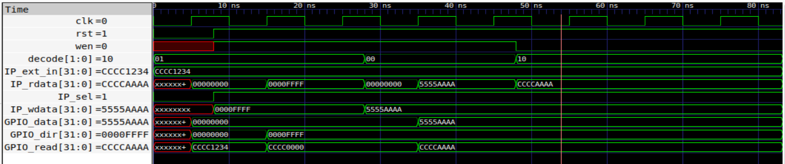
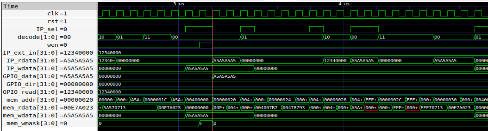
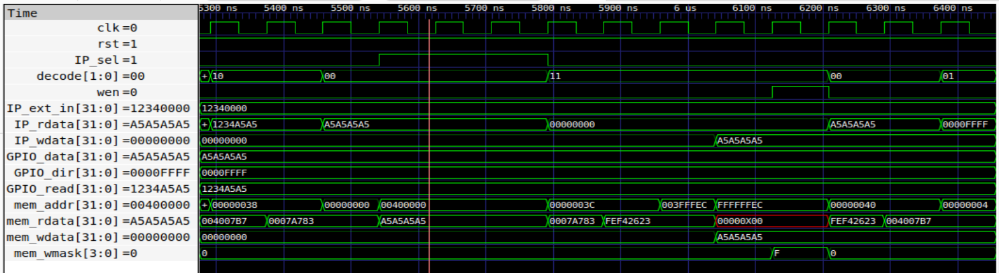
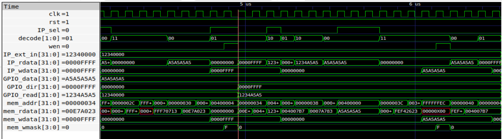
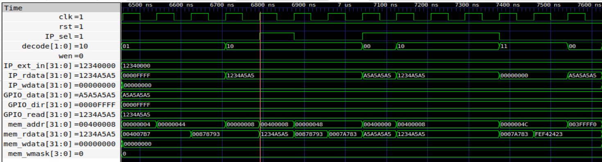

# TASK - 3 Designing a Multi-Register GPIO IP with Software Control
---
## Objectives

Extend the simple GPIO IP from Task-2 into a realistic, multi-register, software-controlled IP.
This task focuses on:
- Designing a proper register map.
- Handling multiple registers inside one IP.
- Strengthening understanding of memory-mapped I/O.
- Validating end-to-end control from software to hardware.

---

<details>
  <summary> STEP - 1 : Study and Planning </summary>

### **Overview**

In this step, the objective is to analyze the existing single-register GPIO IP from Task-2 and plan its extension into a multi-register, software-controlled peripheral. 
The focus is on understanding and design preparation.

---

### **1. Understanding the Existing Design**

The GPIO IP developed in Task-2 consists of a single 32-bit register that supports basic read and write operations through memory-mapped I/O. While functional, it lacks flexibility and configurability required in real-world peripherals.

---

### **2. Design Goal for Extension**

The goal is to transform the simple GPIO into a more realistic IP by:

* Supporting multiple registers within a single IP
* Enabling software control over GPIO direction
* Providing a structured register map for organized access

---

### **3. Register Planning**

A register map is defined to organize the functionality of the GPIO IP:

* **GPIO_DATA** → Stores output values written by the processor
* **GPIO_DIR** → Controls direction of each GPIO pin (input/output)
* **GPIO_READ** → Provides readback of GPIO state

Each register is assigned a unique offset from the base address, enabling multiple functionalities within a single IP block.

---

### **4. Address Offset Strategy**

Since the GPIO IP will now contain multiple registers, address offset decoding is required. The lower bits of the address (`mem_addr[3:2]`) are used to differentiate between registers within the same IP.

This allows the processor to access different registers using:

* Base address + offset

---

### **5. Design Considerations**

* Ensure clean synchronous write logic
* Avoid unintended latch generation
* Maintain compatibility with existing SoC integration
* Keep the design modular and scalable

This step establishes a clear design plan for implementing a multi-register GPIO IP. By defining the register map, address decoding strategy, and required signals in advance, the implementation in subsequent steps becomes structured and error-free.

</details>


<details>
  <summary> STEP - 2 : RTL Design of GPIO Control IP </summary>

### **Overview**

In this step, a multi-register [GPIO Control IP](RTL/GPIO_ctrl_IP.v) is implemented in RTL. The design extends the basic single-register GPIO into a structured peripheral with multiple registers, 
enabling configurable input/output behavior and organized memory-mapped access.

---

### **1. Module Description**

The GPIO Control IP consists of three internal 32-bit registers:

* `GPIO_data` → stores output values written by the processor
* `GPIO_dir` → controls the direction of each GPIO pin
* `GPIO_read` → provides readback data

The IP uses address offset decoding to select the appropriate register for read and write operations.

---

### **2. Signal Description**

| Signal Name     | Direction | Description                                      |
| --------------- | --------- | ------------------------------------------------ |
| `clk`           | Input     | System clock for synchronous operations          |
| `rst`           | Input     | Reset signal to initialize registers             |
| `wen`           | Input     | Write enable signal indicating a write operation |
| `IP_sel`        | Input     | Indicates selection of GPIO IP based on address  |
| `IP_wdata`      | Input     | 32-bit data input from the processor             |
| `IP_rdata`      | Output    | 32-bit data output to the processor              |
| `mem_addr[3:2]` | Input     | Address offset used for register selection       |
| `IP_ext_in`     | Input     | 32-bit data input from external pins             |

---

### **3. Address Offset Decoding**

The lower bits of the address bus (`mem_addr[3:2]`) are used to select between internal registers:

* `2'b00` → GPIO_data
* `2'b01` → GPIO_dir
* `2'b10` → GPIO_read

This allows multiple registers to be accessed using a single base address.

---

### **4. Write Operation**

Write operations are synchronous and occur on the rising edge of the clock. A write is performed only when both the IP is selected and the write enable signal is active.

* Writing to `GPIO_data` updates output values
* Writing to `GPIO_dir` configures pin direction

---

### **5. Read Operation**

Read operations are combinational. The output data is continuously driven based on the selected register and is routed to bus only when IP is selected through control signal.
This ensures immediate response to read requests from the processor.

* Reading from `GPIO_data` returns last written value
* Reading from `GPIO_dir` returns last written direction configuration
* Reading from `GPIO_read` Returns current GPIO pin values,
  * For output pins, reflects driven value
  * For input pins, reflects pin state


---

### **6. Direction Control Logic**

The `GPIO_dir` register determines the mode of each GPIO pin:

* `1` → Output mode
* `0` → Input mode


---

### **7. Design Characteristics**

* Synchronous write logic
* Combinational read logic
* Memory-mapped register interface
* Modular and scalable structure

**Simulation Results** as obtained with a seperate [testbench](RTL/GPIO_ctrl_IP_tb.v) for the design.



The GPIO Control IP RTL successfully implements a multi-register, memory-mapped peripheral. The design provides flexibility through direction control and structured register access, forming a foundation for more advanced peripheral designs.


</details>


<details>
  <summary> STEP - 3 : Integration of GPIO Control IP into SoC </summary>

### **Overview**

In this step, the multi-register GPIO Control IP is integrated into the [RISC-V SoC](RTL/riscv.v) using the memory-mapped I/O mechanism. The integration extends the previous single-register approach by supporting multiple registers within the same IP using address offsets.

---
### **1. Address Mapping**

The GPIO Control IP is mapped into the system I/O memory space starting at a base address of 0x00400000. The following offsets are utilized to access specific internal registers:
- `0x00400000`: GPIO_DATA (Output value storage).
- `0x00400004`: GPIO_DIR (Direction control: 1 for Output, 0 for Input).
- `0x00400008`: GPIO_READ (Status readback of physical pins).

---
### **2. Address Decoding Signal**

Selection logic is implemented within the SoC to activate the peripheral only during valid I/O transactions. 
The GPIO_sel signal is asserted when the isIO page (bit 22 of the address) is active and the specific word address corresponds to the GPIO range. 

In the followed integration, this is represented by:
` GPIO_sel = isIO && (offset == 2'b00 || offset == 2'b01 || offset == 2'b10)`

---

### **3. Write Control Signal**

To prevent unintended register updates, the write sequence is gated by the system memory strobe. The `wen` (Write Enable) signal for the IP is driven by the SoC's `mem_wstrb`. Data is only latched into the `GPIO_data` or `GPIO_dir` registers on the rising edge of the clock when both `IP_sel` and `we`n are high.

---

### **4. Data Path Connections**

The integration establishes a 32-bit bidirectional data path between the processor and the peripheral:
 - Input Data: The CPU's `mem_wdata` bus is connected to the `IP_wdata` port to provide values for the DATA and DIR registers.
 - Output Data: The `IP_rdata` bus from the IP carries the requested register content back to the SoC's central read multiplexer.

---

### **5. GPIO IP Instantiation**

The GPIO_ctrl_IP module is instantiated within the SOC module, mapping the system-level signals to the IP-specific ports. The decode port is mapped to `mem_addr[3:2]` (the word-aligned offset) to distinguish between the three registers.

```
GPIO_ctrl_IP gpio(
      .clk(clk),
      .rst(resetn),
      .decode(offset),
      .IP_sel(GPIO_sel),
      .wen(mem_wstrb),
      .IP_wdata(mem_wdata),
      .IP_ext_in(GPIO_ext_pins),
      .IP_rdata(GPIO_rdata)
   );
```

---

### **6. Read Data Multiplexer Update**

The SoC's central I/O read multiplexer is updated to include the GPIO data path. When the processor performs a load instruction from a GPIO address, the `GPIO_sel` signal ensures that `IP_rdata` is routed to the processor's `mem_rdata bus`. 

This is implemented as:
`IO_rdata = 
	       mem_wordaddr[IO_UART_CNTL_bit] ? { 22'b0, !uart_ready, 9'b0}: 
	       GPIO_sel ? GPIO_rdata : 32'b0;`

---
### **7. Data Flow After Integration**

**Write Operation:**

- CPU writes to GPIO base address + offset
- GPIO_sel becomes active
- Offset selects target register inside IP
- Data is written to the selected register

**Read Operation:**

- CPU reads from GPIO base address + offset
- Offset determines which register is accessed
- Corresponding data is returned


The GPIO Control IP is successfully integrated into the SoC with support for multiple registers through address offset decoding. The design maintains modularity and demonstrates how complex peripherals can be incorporated into a memory-mapped system with minimal changes to the existing architecture.


</details>


<details>
  <summary> STEP - 4 : Validation using C Program based Simulation </summary


### **Overview**

The functionality of the GPIO Control IP is validated using a [C program](RTL/gpio_ctrl_test.c) executed on the RISC-V SoC in simulation. 
This step ensures correct interaction between software and hardware through memory-mapped I/O.

---

### **1. Verification Flow**

The validation process follows a hardware-software co-simulation approach:

1. **C Program Development**

   A [C program](RTL/gpio_ctrl_test.c) is written to:

   * Configure GPIO direction using `GPIO_dir`
   * Write data to `GPIO_data`
   * Read back values using `GPIO_read`

2. **Compilation to HEX**

   The C program is compiled using the RISC-V GCC toolchain.
   The generated ELF file is converted into a [HEX file](RTL/firmware.hex), which is used as instruction memory for the SoC.

```
riscv64-unknown-elf-gcc -O0 -nostdlib -march=rv32i -mabi=ilp32 -Ttext=0x0 gpio_ctrl_test.c -o gpio_ctrl_test.elf
riscv64-unknown-elf-objcopy -O binary gpio_ctrl_test.elf gpio_ctrl_test.bin
hexdump -v -e '1/4 "%08x\n"' gpio_ctrl_test.bin > firmware.hex
```

3. **Loading into Simulation**
   
   The `.hex` file is loaded into the instruction memory using `$readmemh`, allowing the processor to fetch and execute instructions during simulation.

4. **RTL Simulation**
   
   A [testbench](RTL/SOC_IP_tb.v) instantiates the SoC and runs the simulation.
   The processor executes the compiled program, generating memory transactions on the bus.

```
iverilog -o sim.out -DBENCH riscv.v SOC_IP_tb.v && vvp sim.out
gtkwave waves.vcd
```

5. **Observation and Verification**

   * Write operations are observed through `mem_wdata` 
   * Address decoding confirms correct register selection using offsets
   * Read data is verified through `GPIO_rdata`
   * Internal register updates (`gpio_data`, `gpio_dir`) are monitored

---

### **2. Results**

* Correct configuration of GPIO direction was observed
* Write operations successfully updated the GPIO_data register
* Read operations returned expected values from GPIO_read
* Address offset decoding correctly selected internal registers









- External Pin Input : 0x1234000
- Direction set : 0x0000FFFF
- Data Written : 0xA5A5A5A5
- Data Read : 0x1234A5A5


The GPIO Control IP was successfully validated using C-based simulation. The results confirm correct functionality of register mapping, read/write operations, and integration with the RISC-V SoC, demonstrating proper hardware-software interaction.

