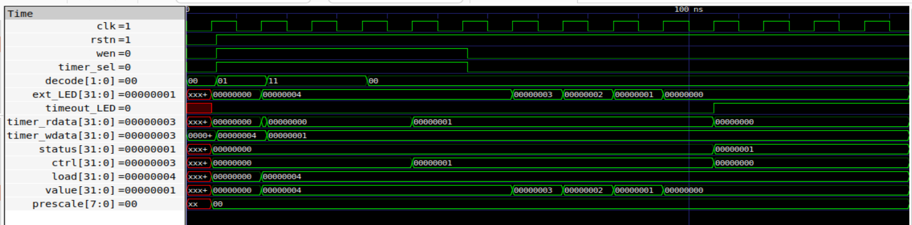
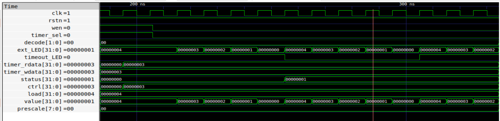
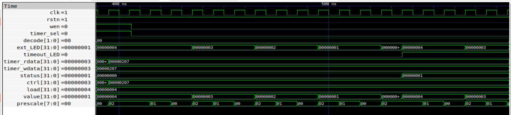
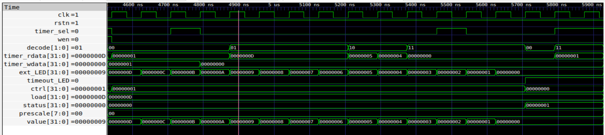
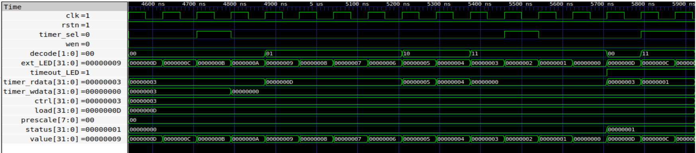
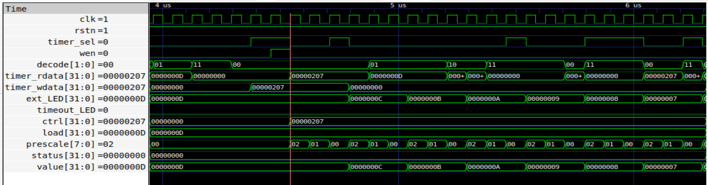

# Timer IP — Minimal SoC Timer

## Overview

This is a memory-mapped programmable [Timer IP](RTL/Timer_IP/timer_ip.v) designed for integration into a [RISC-V SoC](RTL/riscv.v). It supports one-shot and periodic (auto-reload) countdown modes, with an optional clock prescaler for longer timeout intervals. The IP is written in synchronous Verilog and follows the common memory-mapped register interface used across all peripherals in this SoC.

---

<details>
  <summary> STEP - 1 : RTL design of Timer IP </summary>
  
### Overview

The  [Timer IP](RTL/Timer_IP/timer_ip.v) operates as a **down counter**:

- A value is written into the `LOAD` register  
- When enabled (`EN = 1`), the timer starts decrementing  
- The current value is reflected in the `VALUE` register  
- When the counter reaches zero:
  - A `TIMEOUT` flag is set in the `STATUS` register  
  - Based on mode:
    - **One-shot mode**: Timer stops at zero  
    - **Periodic mode**: Timer reloads from `LOAD` and continues  

A **prescaler** is used to divide the clock, allowing slower and more controllable timing intervals.

---

### 1. Register Map

**Base Address:** `0x00400010`

All registers are 32-bit, word-aligned. Reads from undefined offsets return `0`. Writes to undefined offsets are ignored.

| Offset | Name   | Access | Description                        |
|--------|--------|--------|------------------------------------|
| 0x00   | CTRL   | R/W    | Control: enable, mode, prescaler   |
| 0x04   | LOAD   | R/W    | Countdown start value              |
| 0x08   | VALUE  | R      | Current countdown value (live)     |
| 0x0C   | STATUS | R/W    | Timeout flag; write-1-to-clear     |

---

### 2. CTRL — Control Register (`0x00`)

| Bits    | Field     | Description                                          |
|---------|-----------|------------------------------------------------------|
| [0]     | EN        | 1 = enable counting, 0 = stop                        |
| [1]     | MODE      | 0 = one-shot, 1 = periodic (auto-reload)             |
| [2]     | PRESC_EN  | 1 = prescaler enabled, 0 = no prescale               |
| [15:8]  | PRESC_DIV | Prescaler divide value; actual divisor = PRESC_DIV+1 |
| others  | —         | Reserved, read as 0                                  |

---

### 3. LOAD — Load Register (`0x04`)

32-bit countdown start value. When the timer is enabled (EN=1), the counter loads from this register. In periodic mode, it reloads from this register automatically on each timeout.

---

### 4. VALUE — Current Value Register (`0x08`)

Read-only. Reflects the live countdown value as it decrements toward zero. Does not include write access.

---

### 5. STATUS — Status Register (`0x0C`)

| Bits | Field   | Description                                              |
|------|---------|----------------------------------------------------------|
| [0]  | TIMEOUT | Set to 1 when countdown reaches 0. Write 1 to clear.    |
| others | —     | Reserved, read as 0                                      |

---

### 6. Functional Behavior

1. **Starting the timer:** Software writes a value to `LOAD`, then sets `EN=1` in `CTRL`. The counter begins decrementing from `LOAD` each clock cycle (or each prescaled tick if `PRESC_EN=1`).

2. **Timeout:** When `VALUE` reaches 0, the `TIMEOUT` bit in `STATUS` is set. Software polls this bit to detect expiry.

3. **One-shot mode (`MODE=0`):** The timer stops at zero. `VALUE` holds at 0. Software must reload and re-enable for the next countdown.

4. **Periodic mode (`MODE=1`):** On timeout, `VALUE` automatically reloads from `LOAD` and counting continues without software intervention. `TIMEOUT` is still set each cycle for software to observe.

5. **Prescaler:** When `PRESC_EN=1`, the counter decrements once every `(PRESC_DIV+1)` clock cycles, allowing much longer timeouts without requiring large `LOAD` values.

6. **Clearing TIMEOUT:** Write `1` to bit 0 of `STATUS` to clear the flag (write-1-to-clear semantics).


A seperate [IP_testbench](RTL/Timer_IP/timer_ip_tb.v) was used to test the IP individually before integrating into SoC.

- Oneshote mode :



- Auto reload mode:



- Prescale division enabled :



---
</details>


<details>
  <summary> STEP - 2 : Integration of Timer IP into SoC </summary>
  
### 📌 Overview

The Timer IP is integrated into the [RISC-V SoC](RTL/riscv.v) as a **memory-mapped peripheral**, allowing the processor to configure and monitor the timer using standard load/store instructions.

The integration ensures seamless communication between the CPU and the Timer through the system bus.


### 1. Address Decoding

- The Timer IP is selected using **address decoding logic**
- When the incoming bus address matches the Timer address range:
  - `timer_sel` signal is asserted  
- Register selection is done using lower address bits (offset decoding)

---

### 2. Bus Interface Signals

The Timer IP interfaces with the SoC bus using standard signals:

- `clk` → System clock  
- `rstn` → Active-low reset  
- `timer_wdata` → Write data  
- `timer_rdata` → Read data  
- `wen` → Write enable  
- `timer_sel` → Peripheral select  

---

### 3. Write Operation

- When:
  - `timer_sel = 1`
  - `wen = 1`

- Data from `timer_wdata` is written into the selected register:
  - CTRL → control configuration  
  - LOAD → initial count value  
  - STATUS → used for clearing TIMEOUT (W1C)  

---

### 4. Read Operation

- When:
  - `timer_sel = 1`
  - Read operation is performed  

- The selected register value is driven onto `timer_rdata`:
  - CTRL → configuration bits  
  - LOAD → programmed value  
  - VALUE → current countdown  
  - STATUS → timeout flag  

---

</details>


<details>
  <summary> STEP - 3 : Validation using C program based Simulation </summary>
 

### 1. Software Validation

Three separate C files were written to validate each operating mode independently. Each program directly reads and writes the memory-mapped registers using volatile pointer accesses.

- [Program1 - Oneshot mode](Software/timer_test_oneshot.c) — Programs a LOAD value, enables the timer in one-shot mode, polls `status`, then clears the flag and verifies the counter has stopped.
- [Program2 - Auto Reload mode](Software/timer_test_reload.c) — Enables periodic mode and observes multiple successive timeouts without software reload, confirming auto-reload behavior.
- [Program3 - Prescale Division](Software/timer_test_prescale.c) — Enables the prescaler with a chosen `prescalediv` value and verifies that the timeout occurs after the expected number of clock cycles.


The following commands convert the C program to `firmware.hex` file : 
```
riscv64-unknown-elf-gcc -O0 -nostdlib -march=rv32i -mabi=ilp32 -Ttext=0x0 timer_test.c -o timer_test.elf
riscv64-unknown-elf-objcopy -O binary timer_test.elf timer_test.bin
hexdump -v -e '1/4 "%08x\n"' timer_test.bin > firmware.hex
```

---

## Simulation

The [soc_testbench](RTL/SOC_IP_tb.v) instantiates the full SoC and drives the RISC-V core with compiled firmware hex files. All three modes were simulated and confirmed working.

```
iverilog -o sim.out -DBENCH riscv.v SOC_IP_tb.v && vvp sim.out
gtkwave waves.vcd
```

- Value loaded nitially : 0xD


- Value reloaded to : 0xD


- Prescale Value : 0x2 



The Timer IP was successfully designed, integrated, and validated within the RISC-V SoC environment. All key functionalities, including one-shot mode, periodic auto-reload mode, and prescaler based operation, were verified through dedicated C test programs and simulation waveforms. The results confirm correct register behavior, accurate countdown operation, and proper timeout flag handling, demonstrating reliable end to end hardware software interaction.

</details>

